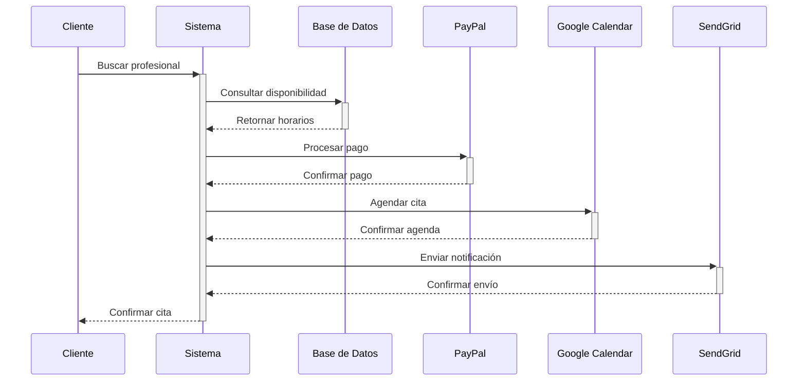
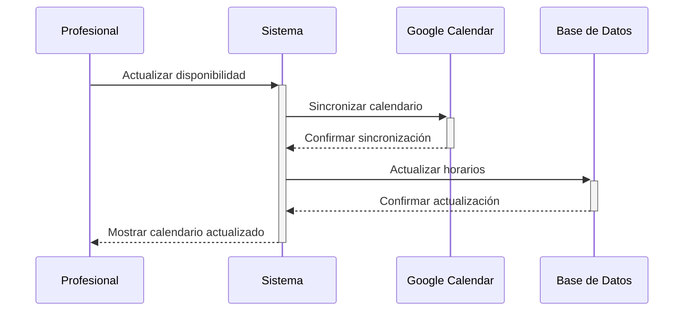

# Arquitectura del Sistema

## Visión General

La aplicación de Gestión de Citas Médicas está construida siguiendo una arquitectura MVC (Modelo-Vista-Controlador) utilizando Flask como framework principal. La aplicación está diseñada para ser modular, escalable y mantenible.

## Diagrama de Arquitectura

```
+------------------+     +------------------+     +------------------+
|                  |     |                  |     |                  |
|    Cliente Web   | <-> |  Servidor Flask  | <-> |   Base de Datos |
|    (Frontend)    |     |    (Backend)     |     |    (SQLite)     |
|                  |     |                  |     |                  |
+------------------+     +------------------+     +------------------+
         ^                       ^                        ^
         |                       |                        |
         v                       v                        v
+------------------+     +------------------+     +------------------+
|   Servicios de   |     |    Sistema de    |     |    Sistema de   |
|    Google Cal    |     |      Pagos       |     |  Notificaciones |
|    (API Ext.)    |     |    (PayPal)      |     |   (SendGrid)   |
+------------------+     +------------------+     +------------------+
```

## Componentes Principales

### 1. Capa de Presentación (Frontend)
- Templates HTML (Jinja2)
- CSS personalizado
- JavaScript para interactividad
- Integración con calendario

### 2. Capa de Aplicación (Backend)
- Controladores Flask (routes/)
- Lógica de negocio
- Gestión de sesiones
- Autenticación y autorización

### 3. Capa de Datos
- Modelos SQLAlchemy
- Gestión de base de datos
- Migraciones

## Módulos del Sistema

### Autenticación (auth.py)
- Registro de usuarios
- Inicio de sesión
- Gestión de sesiones
- Recuperación de contraseña

### Administración (admin.py)
- Gestión de especialidades
- Gestión de usuarios
- Panel de control
- Reportes y estadísticas

### Gestión de Citas (client.py, professional.py)
- Búsqueda de profesionales
- Agendamiento de citas
- Gestión de calendario
- Notificaciones

### Pagos (payment_gateway.py)
- Integración con PayPal
- Procesamiento de pagos
- Confirmaciones
- Reembolsos

## Flujo de Datos

1. **Solicitud de Cita**


2. **Gestión de Calendario**
