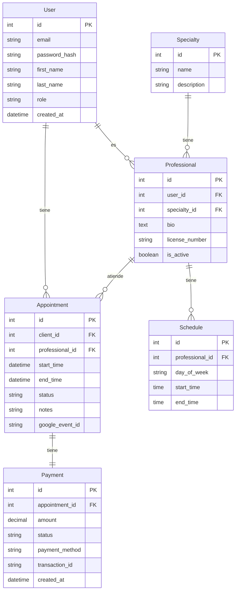

# Modelo de Datos

## Diagrama Entidad-Relación



## Descripción de Entidades

### User (Usuario)
- Almacena información de todos los usuarios del sistema
- Roles: cliente, profesional, administrador
- Gestiona autenticación y datos personales

### Professional (Profesional)
- Extiende la entidad User para profesionales de la salud
- Vincula con especialidad y horarios
- Gestiona información profesional específica

### Specialty (Especialidad)
- Catálogo de especialidades médicas
- Permite categorizar profesionales
- Facilita búsqueda y filtrado

### Appointment (Cita)
- Registro de citas entre clientes y profesionales
- Gestiona estado y seguimiento
- Integración con Google Calendar

### Schedule (Horario)
- Define disponibilidad de los profesionales
- Organizado por días de la semana
- Base para el sistema de agendamiento

### Payment (Pago)
- Registro de transacciones
- Integración con PayPal
- Seguimiento de estados de pago

## Relaciones

1. **User - Appointment**
   - Un usuario puede tener múltiples citas
   - Una cita pertenece a un usuario (cliente)

2. **Professional - Appointment**
   - Un profesional puede tener múltiples citas
   - Una cita tiene un único profesional

3. **Professional - Specialty**
   - Un profesional tiene una especialidad
   - Una especialidad puede tener múltiples profesionales

4. **Professional - Schedule**
   - Un profesional tiene múltiples horarios
   - Un horario pertenece a un único profesional

5. **Appointment - Payment**
   - Una cita tiene un único pago
   - Un pago corresponde a una única cita

## Índices y Optimización

### Índices Principales
```sql
-- Users
CREATE INDEX idx_users_email ON users(email);
CREATE INDEX idx_users_role ON users(role);

-- Professionals
CREATE INDEX idx_professionals_specialty ON professionals(specialty_id);
CREATE INDEX idx_professionals_user ON professionals(user_id);

-- Appointments
CREATE INDEX idx_appointments_client ON appointments(client_id);
CREATE INDEX idx_appointments_professional ON appointments(professional_id);
CREATE INDEX idx_appointments_date ON appointments(start_time);

-- Payments
CREATE INDEX idx_payments_appointment ON payments(appointment_id);
CREATE INDEX idx_payments_status ON payments(status);
```

## Consideraciones de Escalabilidad

1. **Particionamiento**
   - Tabla de citas por fecha
   - Histórico de pagos por año

2. **Caché**
   - Especialidades
   - Horarios de profesionales
   - Información de usuarios frecuentes

3. **Optimización de Consultas**
   - Vistas materializadas para reportes
   - Procedimientos almacenados para operaciones comunes